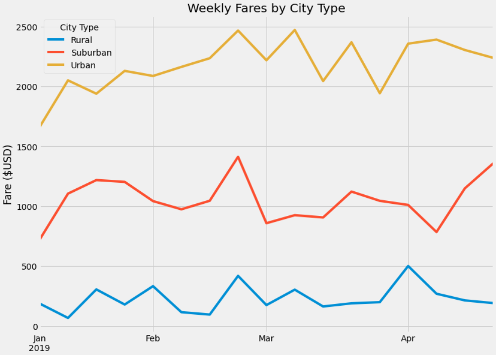

# PyBer Ride Sharing 

> We performed exploratory analysis of how PyBer ride share service is currently operating by focusing on rider and driver behavior in urban, suburban and rural cities. We created graphs that show the total weekly fares, as well as total number of rides and total number of drivers for each city type. Our analyis shows how the data differs by city type and offers suggestions of how those differences can be used by decision-makers at PyBer to improve access to ride sharing services and determine affordability for underserved neighborhoods.

## Results

Our analysis revealed that while the highest demand for PyBer rider sharing is in urban cities, urban city drivers saw fares per ride which are 70% lower than rural city drivers. Additionally, rural drivers earn more per ride, but the demand for ride sharing is 92% less than in urban cities, and 80% less than in suburban cities. 

A significant insight from our analysis is that there is a concentration of PyBer drivers in urban cities, an average of twice as many drivers as there are rides being taken. Reallocating drivers from the urban cities to the rural cities would allow more opportunities for the drivers to increase their income.

 The analysis shows distinct differences in ride-sharing data among the different city types that provides patterns of usage that helps PyBer allocating drivers each month. The graph shows a sharp increase in all city types in late February, followed by a sharp decrease.

 
---
## Summary
Based on the results of our analysis, we offer the following business recommendations to the PyBer CEO for addressing the disparities in rides, fares and driver opportunities among the different city types. 

- Offer ride sharing drivers in rural cities more support by increasing marketing of PyBer services near local transportation hubs.
- PyBer should initiate a 20% fare increase to urban city riders that would put average fares closer to what rural drivers receive. 

[Back To The Top](#pyber-rider-sharing)
